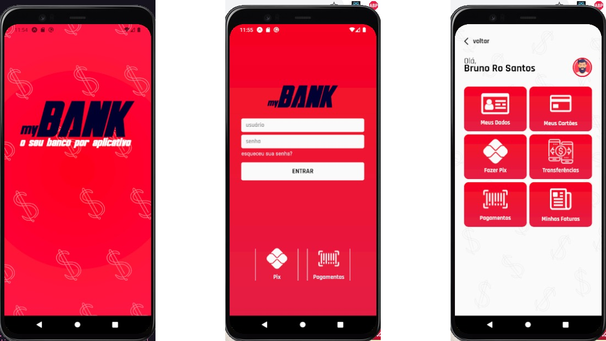

# MyBank



Mybank é um aplicativo baseado nos aplicativos de banco, escrito em typescript e utilizando expo com React Native, seu conteúdo existem duas telas sendo elas: de login e a home. Foi utilizada a API de Contextos do react para manter os dados digitados e as informações exibidas nas telas são apenas demonstrativas.

## 💻 Pré-requisitos

Antes de começar, verifique se você atendeu aos seguintes requisitos:
<!---Estes são apenas requisitos de exemplo. Adicionar, duplicar ou remover conforme necessário--->
* Node v12 ou superior
* expo v41

## 🚀 Executando o MyBank

Para executar o MyBank, siga estas etapas:

```
yarn start 
```
ou

```
expo start
```

## ☕ Usando MyBank em algum dispositivo

Para usar MyBank, é necessário um emulador android/IOS ou um dispositivo físico:

Ao executar o aplicativo o mesmo irá abrir uma página html que basta clicar em qual dispositivo se deseja executar